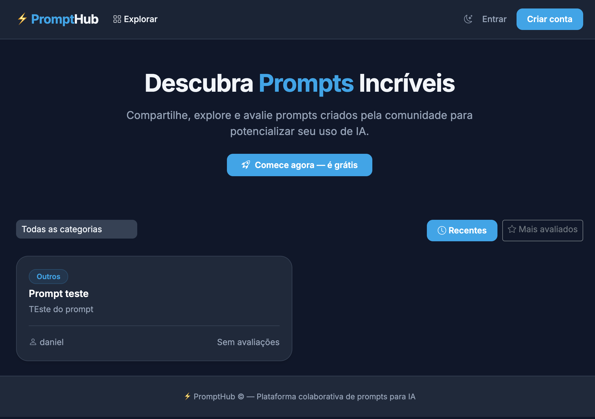
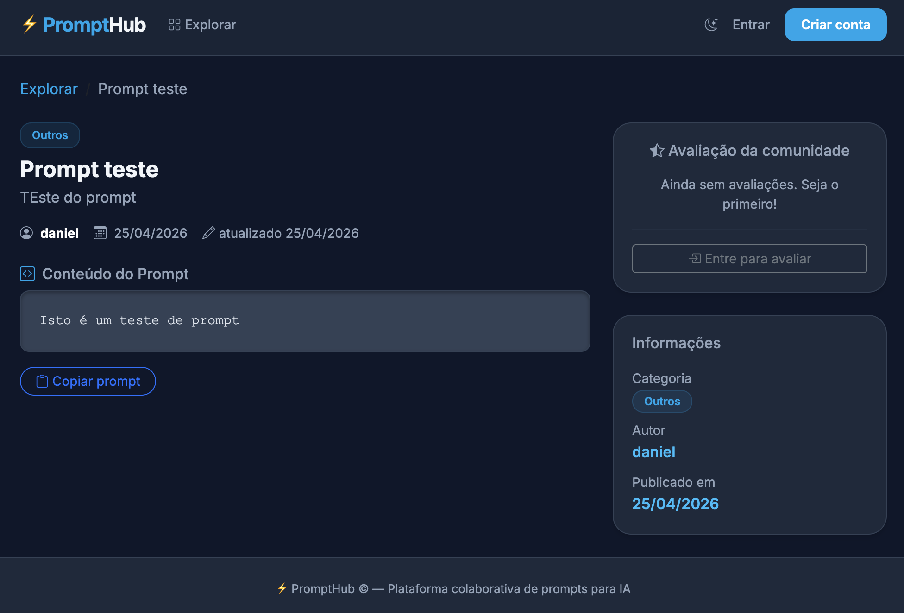

# ⚡ PromptHub

Read in English: [README.md](README.md)

> Plataforma colaborativa para criar, compartilhar e avaliar prompts de IA.


---

## 📺 Demonstração

Assista ao vídeo de exemplo de uso: [https://youtu.be/jm3Hg_0tp84](https://youtu.be/jm3Hg_0tp84)




## 📦 Estrutura do projeto

```
prompthub/
├── config/              # Configurações Django (settings, urls, wsgi)
├── prompts/             # App principal: models, views, forms, urls, admin
├── accounts/            # Autenticação: registro, login, logout
├── templates/           # Templates HTML organizados por app
├── .env.example         # Variáveis de ambiente (sem segredos)
├── requirements.txt
├── Dockerfile
├── docker-compose.yml
├── gunicorn.conf.py     # Configuração do servidor de produção
├── diagrama_er.md       # Diagrama ER em Mermaid
└── VERSION
```

---

## 🚀 Execução local

### 1. Pré-requisitos
- Python 3.13+
- PostgreSQL 16+

### 2. Configure o ambiente

```bash
# Entre no diretório
cd prompthub

# Crie e ative o ambiente virtual
python3 -m venv .venv
source .venv/bin/activate

# Instale as dependências
pip install -r requirements.txt
```

### 3. Configure o banco de dados e variáveis

```bash
# Crie banco e usuário no PostgreSQL
psql -U postgres -c "CREATE USER prompthub WITH PASSWORD 'prompthub1234';"
psql -U postgres -c "CREATE DATABASE prompthub OWNER prompthub;"

# Configure o .env
cp .env.example .env
```

### 4. Migrations e Superusuário

```bash
python manage.py migrate
python manage.py createsuperuser
```

### 5. Inicie o servidor

```bash
python manage.py runserver
```

Acesse: **http://localhost:8000**

---

## 🐳 Execução com Docker

```bash
# Sobe todos os serviços (App + DB)
docker compose up --build -d

# Crie o superusuário
docker compose exec app python manage.py createsuperuser
```

Acesse: **https://app.prompthub.orb.local** (ou o mapeamento definido no seu ambiente).

---

## ✨ Funcionalidades

- **CRUD Completo:** Gerenciamento de prompts (título, descrição, conteúdo, categoria).
- **Sistema de Avaliação:** Notas de 1 a 5 estrelas com proteção contra votos duplicados.
- **Autenticação:** Sistema robusto de registro e login.
- **Filtros e Ordenação:** Navegação por categoria e ordenação por relevância/data.
- **Interface Premium:** Design dark mode com Glassmorphism, baseado em um Design System moderno.
- **Prod-ready:** Configurado com Gunicorn, Docker e variáveis de ambiente seguras.

---

## 🎨 Design System

O projeto segue um guia de estilo rigoroso (veja `UI guide.md` na raiz do repositório) focado em:
- Cores: `Primary Cyan (#0ea5e9)`, `Surface Slate (#0f172a)`.
- Tipografia: `Inter`.
- Efeitos: `Backdrop blur` e `Soft shadows`.
