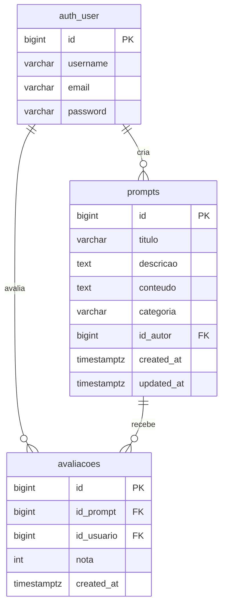

# Diagrama ER — PromptHub

## Regras de negócio
- `avaliacoes(id_prompt, id_usuario)` é `UNIQUE` — um voto por usuário por prompt.
- O autor não pode avaliar seu próprio prompt (regra aplicada na view).
- `nota` aceita apenas valores entre 1 e 5 (validator no model + form).
